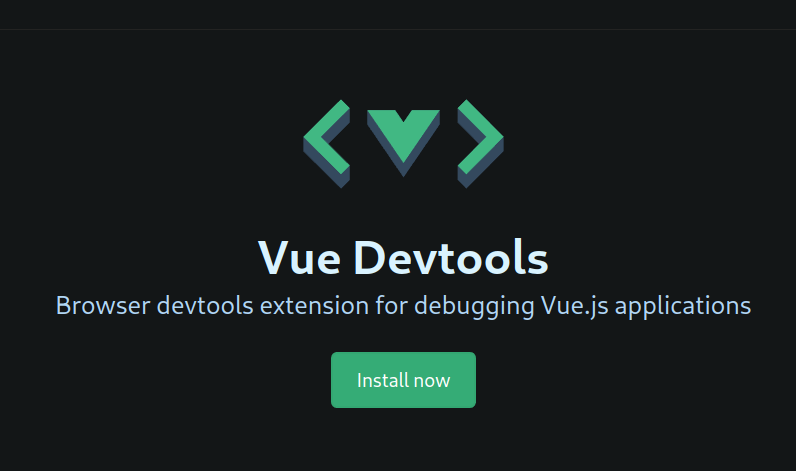

# Capacitación en VuejS

## Descargar el proyecto

Depues de bajar el proyecto se debe de instalar laravel

```
composer install
php artisan key:generate
```

Despues de esto se debe instalar vue y las dependencias de javascript

```
npm install
```

Para iniciar el servidor de desarrollo (debe de estar prendido el servidor Web
y la base de datos [xampp, laragon, etc...]) con los comandos (en terminales separadas)

```
npm run dev
php artisan serve
```

# Crear proyecto desde 0

## Instalar Laravel

[Documentacion de laravel](https://laravel.com/docs/9.x)

> req:
> tener php y composer instalado (laragon)
> Instalar nodejs para npm con VuejS

_Crear el proyecto_

```
composer create-project laravel/laravel <nombre-del-proyecto>
```

### Continuar con Jetstream

Depues de instalar laravel podemos intalar jetstream que configurara "Laravel Fortiy"
y Vue para brindarnos una aplicacion con el frontend end en vue y con autenticacion
preconfigurada.

```
composer require laravel/jetstream
```

Al terminar es necesario crear el projecto de jetstream

```
php artisan jetstream:install inertia
```

Esto instalar Vue y configurara Vite (Podemos saltarnos esos pasos)

```
npm install
```

Se puede continuar en la seccion de Iniciar Servidor

## Instalar sail (opcional require Docker)

Como parte de las herramientas de desarrollo laravel tiene una utilidad
para correr toda la aplicacion dentro de docker con un unico script

la forma de instalarlo es

```
php artisan sail:install
```

Donde nos dará a escoger que servicios utilizaremos.

## Configurar vite (Sin jetstream)

Como utulizaremos vue, es ideal preparar laravel para usar inertia.

Dentro de la configuracion de vite [vite.config.js]
debemos borrar el entrypoint de css y agregarlo al app.js

vite.config.js

```{js}
import { defineConfig } from "vite";
import laravel from "laravel-vite-plugin";

export default defineConfig({
    plugins: [
        laravel({
            input: ["resources/js/app.js"],
            refresh: true,
        }),
    ],
});
```

/resources/js/app.js

```{js}
import './bootstrap';
import '../css/app.css';
```

### Instalar Vue (Sin jetstream)

Instalamos vue

```
npm i vue vue-loader @vitejs/plugin-vue
```

Actualizamos los plugins dentro de vite.config.js

```
import vue from '@vitejs/plugin-vue'
...
plugins: [
    vue({
        template: {
            transformAssetUrls: {
                base: null,
                includeAbsolute: false,
            },
        },
    }),
    ...
```

# Iniciar el Servidor

---

De usar sail se usa el comando ya crae el servidor y la base de datos

```
./vendor/bin/sail up
```

---

Construir los componentes base

```
npm run build
```

Ejecutar las migraciones de la base de datos

```
php artisan migrate
```

Generar nuestra llave de cifrado

```
php artisan key:generate
```

Para ejecutar nuestro servidor de desarrollo tenemos que prender 2 servicios

Artisan para que prenda el servidor web

```
php artisan serve
```

Vite para que "renderice" nuestra pagina en tiempo real

```
npm run dev
```

## Extensiones Recomendadas

-   Dev-tools

    
    [Link dev-tools](https://devtools.vuejs.org/)

-   Vetur

    
    [Link dev-tools](https://devtools.vuejs.org/)

# VUE3

## Temario CLASE 1

-   Estructura
-   Data
-   Metodos (Mehtods)
-   Computed
-   Watchers

## Estructura

Todos los componentes de Vue pueden tener 3 areas principales

```{Vuejs}
<template>
// Aqui va Html
</template>

<script>
export default {
    // Aqui va javascript
};
</script>

<style>
// Aqui va CSS
</style>
```

## Data

La primer parte de cualquier Componente es los datos que maneja: sus Variables

```{Vuejs}
...
<script>
export default {
    data() {
        return {
            var1: 'valor1',
            ...
        }
    },
};
</script>
...
```

Esta data la podemos usar dentro de nuestro componente por medio de la "interpolación"
dentro del "template" o a través de la palabra "this[^1: En options API]" dentro de nuestro script

```{Vuejs}
<template>
    <h1>{{ var1 }}</h1>
</template>
<script>
export default {
    data() {
        return {
            var1: 'valor1',
        }
    },
};
</script>
...
```

## Metodos

Dentro de la logica de nuestro componente necesitmaos definir acciones (metodos)

```{Vuejs}
...
<script>
export default {
    ...
    methods: {
        dameAlgo() {
            // Este metodo nos regresa el valor de var1
            // y le agrega un "algo al final"
            return this.var1 + "algo";
        }
    },
};
</script>
...
```

## Computed

Vue nos permite usar un tipo especial de metodo para tener "variables"
que cambien dinamicamente despues de ser calculados.

```{Vuejs}
<template>
    <h1>El valor de {{ var1 }} es:{{ var2 }}</h1>
</template>
<script>
export default {
    data() {
        return {
            var1: 'valor1',
            valor: 2,
            tasa: 1.16,
        }
    },
    computed: {
        var2() {
            return this.valor * this.tasa;
        }
    },
};
</script>
...
```

## Watchers

Como parte de la reactividad de vue nos permite hacer "observadores" que esten
vigilando el estado de nuestras variables

```{Vuejs}
<template>
    <h1>Hola {{ nombreCompleto }}</h1>
</template>
<script>
export default {
    data() {
        return {
            nombre: 'Santiago',
            apellido: "Orozco",
        }
    },
    computed: {
        nombreCompleto() {
            return `${this.nombre} ${this.apellido}`
        }
    },
    watch: {
        nombreCompleto(newVal, oldVal) {
            console.log({newVal, oldVal})
            alert(newVal)
        }
    }
};
</script>
...
```

## Temario CLASE 2

-   Condicionales
-   v-model
-   Eventos
-   listas (ciclos)

### Condicionales

La carga condicional nos permite generar controlar si vue inserta o no un componente
esto se hace a traves de los atributos "v-show,v-if,v-else"

```{Vuejs}
<template>
    <div v-show="carga">
        <h1>Hola</h1>
        <p v-if="visible">Esto carga si es verdadero</p>
        <p v-else>Esto carga si en otros casos</p>
    </div>


</template>
<script>
export default {
    data() {
        return {
            carga: true,
            visible: false,
        }
    },
};
</script>
...
```

> Vale la pena notar que el comportamiento de v-if y v-show es el mismo pero
> v-if evita que el elemento se inyecte, v-show cambia la "visibilidad", esto
> efectivamente hace que en las herrmientas del editor siga existiendo el html
> pero tenga un "display:none"

### v-model

El v-model es una propiedad que algunos componentes tienen que nos permite
asignar una variable para que sea el contenido del componente.

Su principal utilidad sale cuando vemos el uso de inputs dentro de forms
o cuando buscamos captar informacion del usuario

```{Vuejs}
<template>
    <h1>Bienvenido {{ nombre }}</h1>
    <div>
        <p>Inserta tu nombre:</p>
        <input v-model="nombre" type="text">
    </div>
</template>
<script>
export default {
    data() {
        return {
            nombre: "Alguien muy importante",
        }
    },
};
</script>
...
```

### Eventos

Los eventos son una parte integral de html y como javascript "escucha" los cambios
en el DOM.
Vue nos permite usar un tipo de directiva especial para escuchar estos eventos.

Con la directiva "v-on" podemos pasarle un evento para escuchar, y como cuerpo
de su atributo lo que queremos que haga:

```{Vuejs}
<template>
    <div>{{ contador }}</div>
    <div>
        <button v-on:click="masUno">+</button>
    </div>
</template>
<script>
export default {
    data() {
        return {
            contador: 0,
        };
    },
    methods: {
        masUno() {
            this.contador++;
        },
    },
};
</script>
...
```

la clausula v-on es una de las clausulas que mas se usan y por esto mismo
tiene un "shortcut" o alias. podemos susituir el v-on con un @:

```{Vuejs}
...
<button @click="masUno">+</button>
...
```

Estos eventos tambien tiene modificadores que nos permiten cambiar la forma
o en que accedemos a estos eventos.

> Esta es una lista de algunos modificadores:

-   .stop
-   .prevent
-   .self
-   .capture
-   .once
-   .passive

Ejemplo:

```{Vuejs}
...
<!-- Detiene la porpagacion del evento -->
<a @click.stop="asAlgo"></a>

<!-- Evita que el evento de "submit" recargue la pagina -->
<form @submit.prevent="envia"></form>

<!-- Se pueden usar varios modificadores seguidos -->
<a @click.stop.prevent="asOtraCosa"></a>
...
```

Es un tema bastante extenso y recomiendo leer la documentacion en [Documentacion de vue](https://vuejs.org/guide/essentials/event-handling.html#accessing-event-argument-in-inline-handlers)
y complementar con la documentacion de [MDN: Events](https://developer.mozilla.org/es/docs/Web/Events)

### listas (ciclos)

Para utilizar ciclos usamos la directiva de "v-for" esta clausula nos permite pasar
un arreglo estilo "forIn" donde definiermos la llave que queremos para recorrer nuestro
arreglo de datos

```
<template>
    <h1>Lista de cosas:</h1>
    <ul v-for="dato in datos">
        <li>{{ dato }}</li>
    </ul>
</template>
<script>
export default {
    data() {
        return {
            datos: ['cosa1', 'cosa2', 'cosa3', 'cosa4'],
        };
    },
};
</script>
```

Tambien podemos recorrer un objeto

```
<template>
    <h1>Lista de cosas:</h1>
    <ul v-for="dato in datos">
        <li>{{ dato }}</li>
    </ul>
</template>
<script>
export default {
    data() {
        return {
            datos: {
                val1: 0,
                val2: 1,
                val3: 3
            },
        };
    },
};
</script>
```

Dentro de la directiva podemos pasarle valores opcionales.

```
...
<!-- En caso de un arreglo -->
<ul v-for="(dato, indice) in datos">

<!-- En caso de un objeto -->
<ul v-for="(dato, llave, indice) in datos">
...
```

> La llave "key" es "opcional" pero se recomienda usarla siempre

Se agrega la directiva "key" con un valor unico dentro del arreglo/objeto,
de no tener un id o algo que nos sirva, siempre se puede usar el indice...

```
...
<!-- En caso de un arreglo -->
<ul v-for="(dato, indice) in datos" :key="indice">

<!-- En caso de un objeto -->
<ul v-for="(dato, llave, indice) in datos" :key="indice">
...
```

### v-bind

Vue tiene una directiva que nos permite pasar "javascript" en ves de valores normales
para que al momento de evaluar nuestros elementos podamos insertar valores de nuestro
componente.

Se usa principalemente con href, y class, pero se puede usar para pasar opciones (tema futuro)

```
...
<div :class="variable">Contenido</div>

<a :href="miUrl">soy un link</a>
...
```

Dentro del "binding" de css podemos hacerlo de 2 maneras

-   Arreglo: El arreglo será una lista de variables para evaluar
-   Objeto: Un Objeto donde la llave es la clase y el valor es un booleano para aplicar la clase de manera condicional

```
<template>
    <h1 :class="[margins, 'verdeGordito']">Lista de cosas:</h1>
    <p :class="{sub: selected}">Texto con estilo</p>
    <p :class="okay ? 'verdeGordito' : 'rojoGordito'">Texto con estilo de un arreglo y un objeto</p>
</template>
<script>
export default {
    data() {
        return {
            selected: false,
            okay: false,
            margins: "margin-buttom margin-topi",
            claseActiva: "rojoGordito",
            decorador: "sub",
        };
    },
};
</script>

<style>
.rojoGordito {
    color: red;
    padding: 50px 50px;
    border-radius: 50px;
    border-color: green;
    border-style: solid;
}
.verdeGordito {
    color:green;
    padding: 50px 50px;
    border-radius: 50px;
    border-color: red;
    border-style: dashed;
}
.margin-top {
    margin-top: 20px;
}
.margin-buttom {
    margin-top: 20px;
}
.margin-buttom {
    margin-top: 20px;
}
.sub {
    text-decoration: underline;
}
</style>

```
